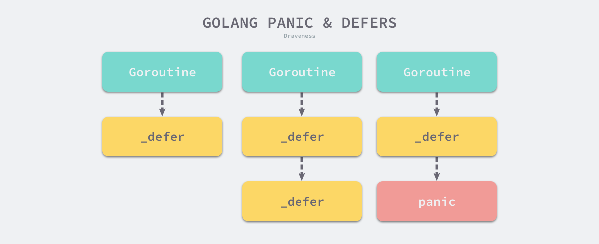

# 笔记

## [Go语言学习](https://draveness.me/golang/)

### [defer](https://draveness.me/golang/docs/part2-foundation/ch05-keyword/golang-defer/)

Go语言的`defer`会在当前函数返回前执行传入的函数, 经常被用于关闭文件描述符, 关闭数据库连接以及解锁资源

使用`defer`的最常见场景是在函数调用后完成一些收尾工作, 例如在`defer`中回滚数据库的事务

```go
func createPost(db *gorm.DB) error {
    tx := db.Begin()
    defer tx.Rollback()
    
    if err := tx.Create(&Post{Author: "Draveness"}).Error; err != nil {
        return err
    }
    
    return tx.Commit().Error
}
```

在使用数据库事务时, 我们可以使用上面的代码, 在创建事务后就立刻调用`defer tx.Rollback()`保证事务一定会回滚

哪怕事务真的执行成功了, 那么调用`tx.Commit()`之后再执行`tx.Rollback()`也不会影响已提交的事务, 而如果执行失败了, 则可以保证`tx.Rollback()`最终会被执行, 从而保证事务被回滚

#### 1.现象

我们在Go语言中使用`defer`时会遇到两个常见问题, 这里会介绍具体的场景并分析这两个现象背后的设计原理:

- `defer`关键字的调用时机以及多次调用`defer`时执行顺序是如何确定的
- `defer`关键字使用传值方式传递参数时会进行预计算, 导致不符合预期的结果

##### 作用域

向`defer`关键字传入的函数会在函数返回前运行. 假设我们在`for`循环中多次调用`defer`关键字

```go
func main() {
	for i := 0; i < 5; i++ {
		defer fmt.Println(i)
	}
}
```

运行结果如下

```shell
$ go run main.go
4
3
2
1
0
```

运行上述代码会倒叙执行传入`defer`关键字的所有表达式, 因为最后一次调用`defer`传入了`fmt.Println(4)`, 所以这段代码会优先打印4. 我们可以通过下面这个简单例子强化对`defer`执行时机的理解

```go
func main() {
    {
        defer fmt.Println("defer runs")
        fmt.Println("block ends")
    }
    
    fmt.Println("main ends")
}
```

运行结果如下

```shell
$ go run main.go
block ends
main ends
defer runs
```

从上述代码的输出我们会发现, `defer`传入的函数不是在退出代码块的作用域时执行的, 它只会在当前函数和方法返回之前被调用

##### 预计算参数

Go语言中所有的函数调用都是传值的, 虽然`defer`是关键字, 但是也继承了这个特性. 假设我们想要计算`main`函数运行的时间, 可能会写出以下的代码

```go
func main(){
    startedAt := time.Now()
    defer fmt.Println(time.Since(startedAt))

    time.Sleep(time.Second)
}
```

运行结果如下

```shell
$ go run main.go
0s
```

然而上述代码的运行结果并不符合我们的预期, 这个现象背后的原因是什么呢? 经过分析, 我们会发现调用`defer`关键字会立刻拷贝函数中引用的外部参数, 所以`time.Since(startedAt)`的结果不是在`main`函数退出前计算的, 而是在`defer`关键字调用时计算的, 最终导致上述代码输出0s

想要解决这个问题的方法非常简单, 我们只需要向`defer`关键字传入匿名函数

```go
func main(){
    startedAt := time.Now()
    defer func() { fmt.Println(time.Since(startedAt)) }()

    time.Sleep(time.Second)
}
```

运行结果如下

```shell
$ go run main.go
1s
```

虽然调用`defer`关键字时也使用值传递, 但是因为拷贝的是函数指针, 所以`time.Since(startedAt)会在`main`函数返回前调用并打印出符合预期的结果

#### 2.数据结构

在介绍`defer`函数的执行过程与实现原理之前, 我们首先来了解以下`defer`关键字在Go语言源代码中对应的数据结构

```go
type _defer struct{
    siz         int32
    started     bool
    openDefer   bool
    sp          uintptr
    pc          uintptr
    fn          *funcval
    _panic      *_panic
    link        *_defer
}
```

`runtime._defer`结构体是延迟调用链表上的一个元素, 所有的结构体都会通过`link`字段串联成链表


我们简单介绍一下`runtime._defer`结构体中的几个字段

- `siz`是参数和结果的内存大小
- `sp`和`pc`分别代表栈指针和调用方的程序计数器
- `fn`是`defer`关键字中传入的函数
- `_panic`是触发延迟调用的结构体, 可能为空
- `openDefer`表示当前`defer`是否经过开放编码的优化

除了上述的这些字段之外, `runtime._defer`中还包含一些垃圾回收机制使用的字段, 这里为了减少理解的成本就省去了

#### 3.执行机制

中间代码生成阶段的`cmd/compile/internal/gc.state.stmt`会负责处理程序中的`defer`, 该函数会根据条件的不同, 使用三种不同的机制处理该关键字

```go
func (s *state) stmt(n *Node) {
	...
	switch n.Op {
	case ODEFER:
		if s.hasOpenDefers {
			s.openDeferRecord(n.Left) // 开放编码
		} else {
			d := callDefer // 堆分配
			if n.Esc == EscNever {
				d = callDeferStack // 栈分配
			}
			s.callResult(n.Left, d)
		}
	}
}
```

堆分配、栈分配和开放编码是处理`defer`关键字的三种方法, 早期的Go语言会在堆上分配`runtime._defer`结构体, 不过该实现性能较差, Go语言在1.13中引入栈上分配的结构体, 减少了30%的额外开销, 并在1.14中引入了基于开放编码的`defer`, 使得该关键字的额外开销可以忽略不计, 我们在一节中会分别介绍三种不同类型的`defer`的设计与实现原理

#### 4.堆上分配

根据 `cmd/compile/internal/gc.state.stmt` 方法对 `defer` 的处理我们可以看出, 堆上分配的 `runtime._defer` 结构体是默认的兜底方案, 当该方案被启用时, 编译器会调用 `cmd/compile/internal/gc.state.callResult` 和 `cmd/compile/internal/gc.state.call`, 这表示 `defer` 在编译器看来也是函数调用

`cmd/compile/internal/gc.state.call` 会负责为所有函数和方法调用生成中间代码, 它的工作包括以下内容

1. 获取需要执行的函数名、闭包指针、代码指针和函数调用的接收方
2. 获取栈地址并将函数或者方法的参数写入栈中
3. 使用 `cmd/compile/internal/gc.state.newValue1A` 以及相关函数生成函数调用的中间代码
4. 如果当前调用的函数是 `defer`，那么会单独生成相关的结束代码块
5. 获取函数的返回值地址并结束当前调用

```go
func (s *state) call(n *Node, k callKind, returnResultAddr bool) *ssa.Value {
	...
	var call *ssa.Value
	if k == callDeferStack {
		// 在栈上初始化 defer 结构体
		...
	} else {
		...
		switch {
		case k == callDefer:
			aux := ssa.StaticAuxCall(deferproc, ACArgs, ACResults)
			call = s.newValue1A(ssa.OpStaticCall, types.TypeMem, aux, s.mem())
		...
		}
		call.AuxInt = stksize
	}
	s.vars[&memVar] = call
	...
}
```

从上述代码中我们能看到, `defer` 关键字在运行期间会调用 `runtime.deferproc`, 这个函数接收了参数的大小和闭包所在的地址两个参数


#### 5.栈上分配

#### 6.开放编码

#### 7.小结

#### 8.延伸阅读

### [pinic 和 recover](https://draveness.me/golang/docs/part2-foundation/ch05-keyword/golang-panic-recover/)

本节将分析 Go 语言中两个经常成对出现的两个关键字 — `panic` 和 `recover`. 这两个关键字与上一节提到的 [defer](#defer) 有紧密的联系, 它们都是 Go 语言中的内置函数, 也提供了互补的功能


- `panic`能够改变程序的控制流, 调用`panic`后会立刻停止执行当前函数的剩余代码, 并在当前`Goroutine`中递归执行调用方的`defer`
- `recover`可以中止`panic`造成的程序崩溃. 它是一个只能在`defer`中发挥作用的函数, 在其他作用域中调用不会发挥作用

#### 1.现象

我们先通过几个例子了解一下使用`panic`和`recover`关键字时遇到的现象, 部分现象也与上一节分析的`defer`关键字有关

- `panic`只会触发当前`Goroutine`的`defer`
- `recover`只有在`defer`中调用才会生效
- `panic`允许在`defer`中嵌套多次调用

##### 跨协程失效

首先要介绍的现象时`panic`只会触发当前`Goroutine`的延迟函数调用, 我们可以通过如下所示的代码了解该现象

```go
func main() {
	defer println("in main")
	go func() {
		defer println("in goroutine")
		panic("")
	}()

	time.Sleep(1 * time.Second)
}
```

运行结果如下

```shell
$ go run main.go
in goroutine
panic:
...
```

当我们运行这段代码时会发现`main`函数中的`defer`语句并没有执行, 执行的只有当前`Goroutine`中的`defer`

前面我们曾经介绍过`defer`关键字对应的`runtime.deferproc`会将延迟调用函数与调用方所在`Goroutine`进行关联. 所以当程序发生崩溃时只会调用当前`Goroutine`的延迟调用函数也是非常合理的



如上图所示, 多个 `Goroutine` 之间没有太多的关联, 一个 `Goroutine` 在 `panic` 时也不应该执行其他 `Goroutine` 的延迟函数

##### 失效的崩溃恢复

初学Go语言的读者可能会写出下面的代码, 在主程序中调用`recover`试图中止程序的崩溃, 但是从运行的结果中我们也能看出, 下面的程序没有正常退出

```go
func main() {
	defer fmt.Println("in main")
	if err := recover(); err != nil {
		fmt.Println(err)
	}

	panic("unknown err")
}
```

运行结果如下

```shell
$ go run main.go
in main
panic: unknown err

goroutine 1 [running]:
main.main()
	...
exit status 2
```

仔细分析一下这个过程就能理解这种现象背后的原因, `recover`只有在发生`panic`之后调用才会生效. 然而在上面的控制流中, `recover`关键字是在`panic`之前调用的, 并不满足生效的条件, 所以我们需要在`defer`中使用`recover`关键字

##### 嵌套崩溃

Go语言中的`panic`是可以多次嵌套调用的. 一些熟悉Go语言的读者很可能也不知道这个知识点, 如下所示的代码就展示了如何在`defer`函数中多次调用`panic`

```go
func main() {
	defer fmt.Println("in main")
	defer func() {
		defer func() {
			panic("panic again and again)
		}()
		panic("panic again)
	}()

	panic("panic once)
}
```

运行结果如下

```shell
$ go run main.go
in main
panic: panic once
	panic: panic again
	panic: panic again and again

goroutine 1 [running]:
...
exit status 2
```

从上述程序输出的结果, 我们可以确定程序多次调用`panic`也不会影响`defer`函数的正常运行, 所以使用`defer`进行收尾工作一般来说都是安全的

#### 2.数据结构

`panic`关键字在Go语言的源代码是由数据结构`runtime._panic`表示的. 每当我们调用`panic`都会创建一个如下所示的数据结构存储相关信息

```go
type _panic struct {
	argp      unsafe.Pointer
	arg       interface{}
	link      *_panic
	recovered bool
	aborted   bool
	pc        uintptr
	sp        unsafe.Pointer
	goexit    bool
}
```

1. `argp`是指向`defer`调用时参数的指针
2. `arg`是调用`panic`时传入的参数
3. `link`指向了更早调用的`runtime._panic`结构
4. `recovered`表示当前`runtime._panic`是否被`recover`恢复
5. `aborted`表示当前的`panic`是否被强行终止

从数据结构中的`link`字段我们就可以推测出以下的结论: `panic`函数可以被连续多次调用, 它们之间通过`link`可以组成链表

结构体中`pc`, `sp` 和 `goexit` 三个字段都是为了修复`runtime.Goexit`带来的问题引入的. `runtime.Goexit`能够只结束调用该函数的Goroutine而不影响其他的Goroutine, 但是该函数会被`defer`中的`panic`和`recover`取消, 引入这三个字段就是为了保证该函数一定会生效